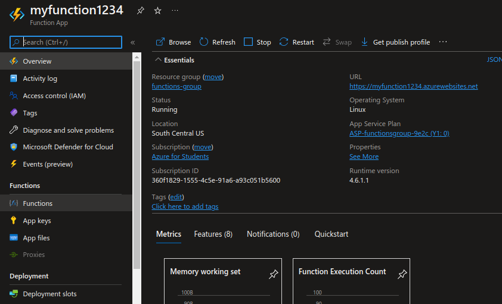

# Creating an Azure Function that calculates factorial of n

---------------------------------------------------------

## Requirements
- Microsoft Azure Account ( with funds or credits    )
- Microsoft Azure Suscription
- A web browser

---------------------------------------------------------

## Instructions
#### 1. Login to the [Azure Portal](https://portal.azure.com/).
#### 2. Once your on the portal's home page, you will see something like this:

#### 3. Inside the search bar (located at the top), look for *Function App* and click on it.

#### 4. Click on *Create*.

#### 5. You will now have to configure the project details: select your suscription and resource group, in my case, I'll be creating a new resource group.

#### 6. Now, you need to conigure the function details. First, give it a name. We'll be using Python code, so make sure to select code. You must also choose the region where your code will be executed.

#### 7. Also, you need to choose the operating system and plan for your Function App. I'll be using Linux and Consumption (Serverless).

#### 8. You can configure more details about your function if you want at the top side of the page or by clicking next. When you're ready, click *Review + create*.

#### 9. If validation passed, click *Create*.

#### 10. Deployment will begin, please wait a couple of seconds.

#### 11. Once deployment is complete, click on *Go to resource*.

#### 12. On the left side of the dashboard, click on *Functions*.

#### 13. Click on *Create*.

#### 14. You can now choose the development environment where you'll create your function (portal, inside another code editor or VS code), I'll be making my function inside the portal. Then, you'll need to select the trigger for your function, I'll be choosing *HTTP trigger* because it's what I'll be using.

#### 15. Click *Create*.
#### 16. Click on *Code + Test*.

#### 17. You will now be inside a code editor where there will be default Python code; as it is, it's already functional, however, we will be replacing this code with the one inside this repository.

#### 18. Copy what's inside *code.py* (located inside this repository) and replace what's in the Azure Portal's editor.

#### 19. In order to test your code, click on the *Test/code* button.

#### 20. In the body section, put "num": (number you want to calculate).

#### 21. Click *Run* to test your function.

#### 22. The result of your function will appear on screen.

---------------------------------------------------------

## Congratulations ! You've just made your first Azure Function! =)